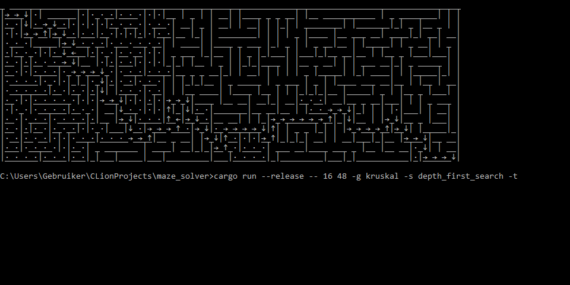

# How to Run

```
Usage: maze_solver.exe [OPTIONS] <--generator <GENERATOR>|--input <INPUT>> [ROWS] [COLUMNS]

Arguments:
  [ROWS]     Number of rows to draw [default: 16]
  [COLUMNS]  Number of columns to draw [default: 48]

Options:
  -g, --generator <GENERATOR>  Generator used [possible values: depth_first_search, breadth_first_search, kruskal]
  -i, --input <INPUT>          Input path used
  -s, --solver <SOLVER>        Solver used. If Some, then the generator will run with a delay of 0 [possible values: depth_first_search]
  -t, --trace                  Flag to enable drawing visited cells
  -d, --delay <DELAY>          Number of milliseconds between animation [default: 25]
  -h, --help                   Print help information
  -V, --version                Print version information
```

Here are some examples:

```
# Animate generating a 10 by 12 maze using the depth-first seach generator.
cargo run --release -- 10 12 -g depth_first_search

# Animate generating a 16 by 48 maze using the depth-first seach generator and a delay of 0ms (instant).
cargo run --release -- -g depth_first_search -d 0

# Animate solving a 16 by 48 kruskal maze using the depth-first search solver.
cargo run --release -- -g kruskal -s depth_first_search

# Animate solving a 16 by 48 kruskal maze with trace using the depth-first search solver.
cargo run --release -- -g kruskal -s depth_first_search -t

# Animate solving the medium sized example using the depth-first search solver.
cargo run --release -- -i examples/medium.maze -s depth_first_search
```

I tested that this works on at least Windows 10, Ubuntu and macOS.

# Generators

The following generators are included:
<details><summary>Randomized depth-first search.</summary>


</details>

<details><summary>Randomized breadth-first search.</summary>


</details>

<details><summary>Kruskal's algorithm.</summary>


</details>

# Solvers

The following solvers are included:
<details><summary>Depth-first search</summary>


</details>

# Note on Design

It was important to me that large mazes could be drawn in a limited space, which meant that some thought had to be given
on how the maze should be represented. A simple (yet effective) representation would look like this:

```
+ +-+   [N, H]     
| | |   [V, V, V]     
+ +-+   [N, H]
|   |   [V, N, V]
+-+ +   [H, N]

H: Horizontal,
V: Vertical,
N: None,
```

This is 5x5 character matrix to represent a 2x2 maze. We can do better by combining the vertical and horizontal walls
into the same line:

```
_ ___   [H, N, H, H, H]
| |_|   [V, N, H, V, H]
|__ |   [V, H, N, N, V]

H: Horizontal,
V: Vertical,
N: None,
```

This gives us a 3x3 character matrix, which is a lot better! Furthermore, if replace the underscores with underlines,
then we can actually draw characters inside the cells. This allows for very nice looking animations.